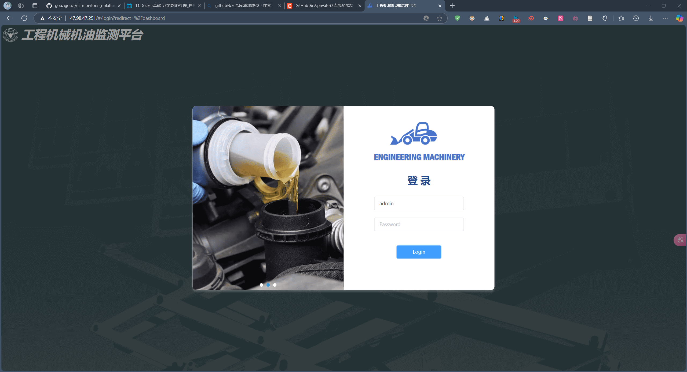

# Oil-Monitoring-Platform

此仓库介绍了机油监测平台设计部署，同时实现网页端数据可视化和在线编辑，效果图如下所示：

该仓库分成两部分，第一部分介绍了**机油监测平台设计过程**，第二部分介绍了**机油监测平台部署过程**。

## [机油监测平台设计过程](design)
机油监测平台设计过程分成三部分，对应前端、后端和算法的开发。

## [机油监测平台部署过程](deployment)
使用Debian 11.9版本，2核2GB阿里云服务器进行机油监测平台部署。

