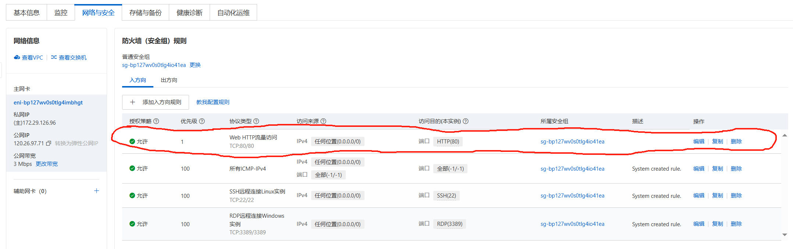

# 机油监测平台部署
该部分介绍了如何将设计的机油监测平台在服务器中部署，实现在网页端的可视化数据显示

为了实现对机油监测平台网页的部署有些前置知识需要学习，其中包括linux基本命令、Docker基本命令、Docker Compose基本命令、前后端系统部署流程。这里提供[Docker快速入门到项目部署视频教程](https://www.bilibili.com/video/BV1HP4118797/?spm_id_from=333.337.search-card.all.click&vd_source=8887203531d447abe2f7b3607f51cb05)

所面向的部署环境为Debian操作系统，使用Docker创建镜像和容器。所需要部署的模块由五部分组成：Nginx（前端UI）、Jar（后端Java）、Python（算法）、Postgres（业务数据库）、Redis（缓存数据库）

此项目中租用阿里云服务器，使用Debian 11.9版本，2核2GB，使用上述配置租用一年仅需99，具体配置如下图所示：


对于所提供的[home文件夹](home)，将其复制到服务器中home文件夹中，按照下面所提供的指令就可以实现部署，接下来结合文件夹结构图对其进行介绍，这里需要注意的是**图片中的三个tar并没有上传到仓库中**：


正如上文所提及的所部署的模块共有五块，home文件夹也有五个文件夹所构成：

oil-admin-template文件夹对应Nginx（前端UI）

oil-template文件夹对应Jar（后端Java）

oil_pred文件夹对应Python（算法）

postgres文件夹对应Postgres（业务数据库）

redis文件夹对应Redis（缓存数据库）

而剩下来的三个tar是测试时保留下来的环境镜像，接下来可以直接使用这三个tar包进行镜像下载，而不需要去Docker hub上进行在线下载（其中经测试因为版本问题Redis和Postgres使用镜像下载的版本与所提供文件夹中内容不太对应，而Nginx使用Docker hub在线下载的版本不会出现问题，因此还是建议使用所提供的tar包进行镜像下载）

# 机油监测平台部署具体流程
## 步骤1：Docker安装
在服务器上安装Docker，这一块网上资源很多，可以自己查找下载安装

可以参考以下两篇博客进行Docker安装:

[Debian安装docker全流程](https://blog.csdn.net/weixin_43961117/article/details/126125976)

[【建议收藏】Debian系统上安装Docker全流程](https://blog.csdn.net/m0_57021623/article/details/138590870)

## 步骤2：网络创建
为了实现五个容器的互联，需要建立一个网络同时将五个容器全都接入这个网络中。在这里我建立了一个名为oilwatch的网络，并在之后容器创建运行时接入这个网络:

```
docker network create oilwatch
```

## 步骤3：Redis（缓存数据库）部署
主要参考博客：[Docker 安装 Redis 容器 (完整详细版)](https://blog.csdn.net/BThinker/article/details/123374236)

如果已经将上述提及的[home文件夹](home)复制到服务器中home文件夹中，即可使用下述指令来实现Redis部署

使用下述指令实现镜像下载：

```
docker load -i redis.tar
```

使用下述指令实现容器创建和运行：

```
docker run \
--name redis \
-p 6379:6379 \
-v /home/redis/data:/data \
-v /home/redis/conf/redis.conf:/etc/redis/redis.conf \
--network oilwatch \
-d redis redis-server /etc/redis/redis.conf
```

## 步骤4：Postgres（业务数据库）部署
主要参考博客：[PostgreSQL数据库——Docker版本的postgres安装 & Navicat连接方式+导入向导使用 & SpringBoot结合Jpa使用PostgreSQL初步](https://blog.csdn.net/Pireley/article/details/132312178)

使用下述指令实现镜像下载：

```
docker load -i postgres.tar
```

使用下述指令实现容器创建和运行：

```
docker run -d \
--name postgresql \
-p 5432:5432 \
-e POSTGRES_PASSWORD=111111 \
-e LANG=C.UTF-8 \
-v /home/postgres/data:/var/lib/postgresql/data \
--network oilwatch \
postgres:13.14-bullseye
```

## 步骤5：Python（算法）部署
主要参考博客：[使用Docker部署Python Flask应用的完整教程](https://blog.csdn.net/Rocky006/article/details/134462963)

这里需要进入到oil_pred文件夹下，使用下述指令实现镜像构建：

```
docker build -t algorithm-prod .
```

使用下述指令实现容器创建和运行：

```
docker run -d --name algorithm -p 5000:5000 --network oilwatch algorithm-prod
```

## 步骤6：Jar（后端Java）部署
主要参考博客：[Docker部署java项目（Dockerfile方式）](https://blog.csdn.net/zhabnghenglmm/article/details/124310381)

这里需要进入到oil-template文件夹下，使用下述指令实现镜像构建：

```
docker build -t oil-template-prod .
```

使用下述指令实现容器创建和运行：

```
docker run -d --name oil-template -p 8999:8999 --network oilwatch oil-template-prod
```

## 步骤7：Nginx（前端UI）部署
主要参考博客：

[Docker 安装 Nginx 容器 (完整详细版)](https://blog.csdn.net/BThinker/article/details/123507820)

[【Nginx】Docker安装配置Nginx实现前端项目部署](https://blog.csdn.net/qq_43781399/article/details/112950115)

使用下述指令实现镜像下载：

```
docker load -i nginx.tar
```

使用下述指令实现容器创建和运行：

```
docker run \
-p 80:9528 \
--name nginx \
-v /home/oil-admin-template/nginx.conf:/etc/nginx/nginx.conf \
-v /home/oil-admin-template/dist:/usr/share/nginx/html \
--network oilwatch \
-d nginx:latest
```

# 机油监测平台部署结果
根据前面步骤如果正常可以得到如下结果：


需要注意一点，使用阿里云服务器需要对服务器防火墙（安全组）规则进行设置，才能在网页上正常显示界面，这里参考了[如何设置阿里云服务器安全组？阿里云安全组规则详细解说](http://tencent.yundashi168.com/331.html)，具体配置示意图如下：



最终配置成功后使用服务器IP即可登录平台，展示图如下：


