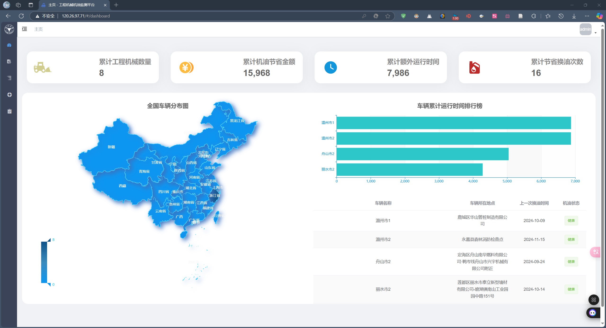
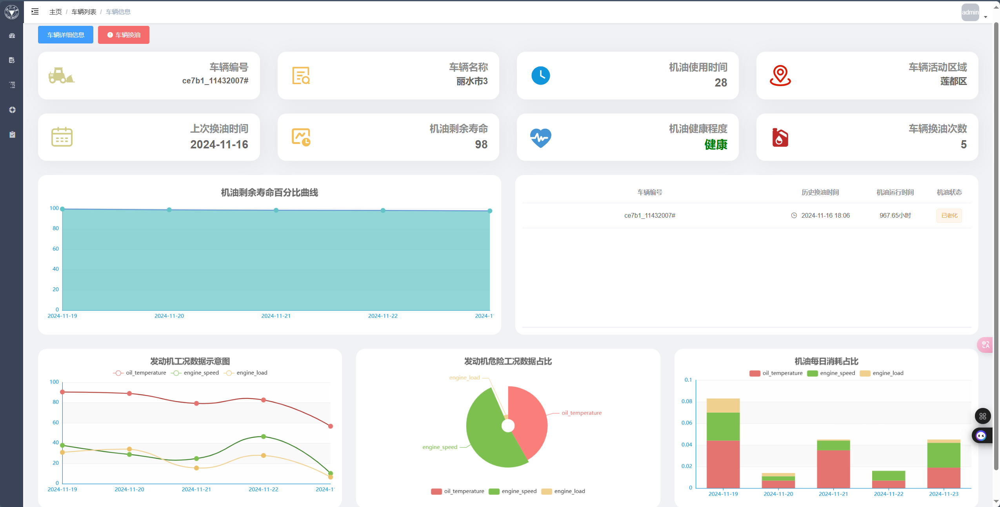
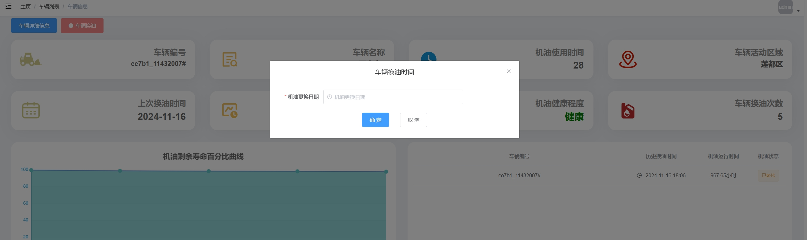
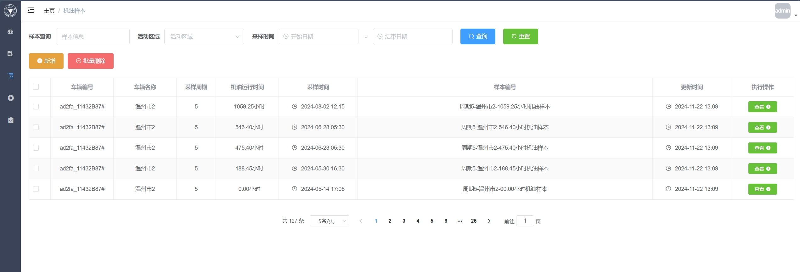
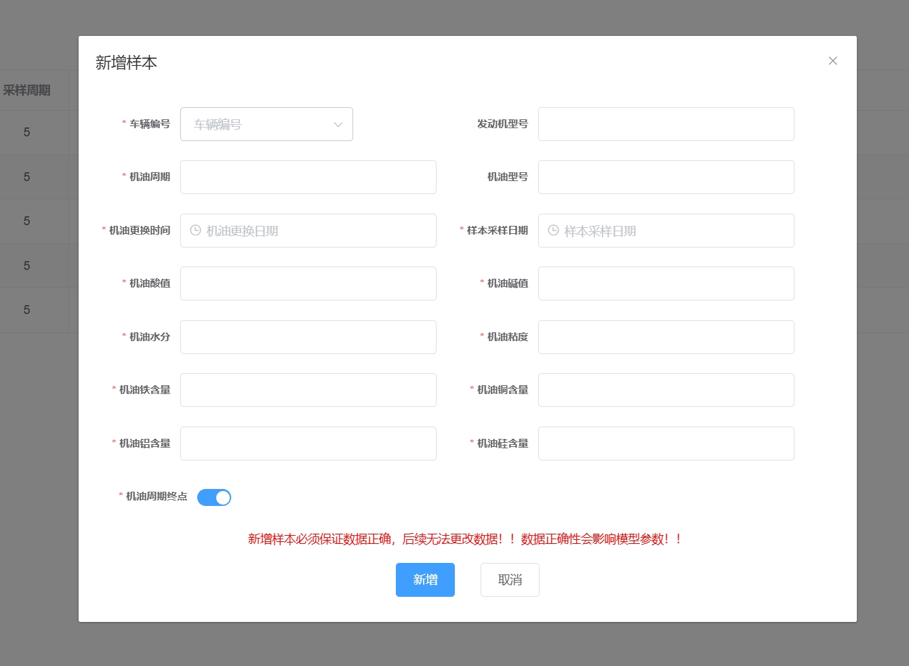

# 机油监测平台前端代码介绍
此前端代码基于开源框架vue-admin-template进行二次开发

看此介绍文档最好结合[机油监测平台](http://120.26.97.71/)进行

## dashboard文件夹（主页）
用于展示车辆运行数据的可视化面板，接下来对每一个文件进行展开介绍

### [index.vue](dashboard/index.vue)
仪表盘模块的主页面，也就是机油监测平台登陆进去后的首个界面

其中调用了components文件夹下的四个vue文件来构成主界面，接收数据并将数据传递到各个子组件中

### [components/BarChat.vue](dashboard/components/BarChat.vue)
用于车辆累计运行时间排行榜制作，是一个基于 ECharts 的横向柱状图组件

### [components/PanelGroup.vue](dashboard/components/PanelGroup.vue)
数据总览的面板组件，在主界面的顶部展示，包含多个卡片样式的数字展示

### [components/sctterMap.vue](dashboard/components/sctterMap.vue)
车辆位置散点图制作，使用 ECharts 的地理坐标系（geo）展示车辆 GPS 散点

### [components/TransactionTable.vue](dashboard/components/TransactionTable.vue)
运行记录表格制作，展示车辆名称、车辆所在地点、上一次换油时间和机油状态信息

## form文件夹（车辆信息页面）
用于处理车辆表单、油品信息、图表展示等

### [index.vue](form/index.vue)
车辆信息页面，继承多个子组件，接收数据并将数据传递到各个子组件中

### [components/ChangeOilDialog.vue](form/components/ChangeOilDialog.vue)
车辆换油时间弹窗制作

### [components/ChangeOilInfo.vue](form/components/ChangeOilInfo.vue)
车辆信息页面中部右侧表格制作，展示机油信息

### [components/EngineBarChart.vue](form/components/EngineBarChart.vue)
机油每日消耗占比图，使用柱状图展示油温、发动机转速和发动机负载

### [components/EngineLineChart.vue](form/components/EngineLineChart.vue)
发动机工况数据示意图，使用曲线图展示油温、发动机转速和发动机负载

### [components/EnginePieChart.vue](form/components/EnginePieChart.vue)
发动机危险工况数据占比图，使用饼图展示油温、发动机转速和发动机负载

### [components/OilLifeChart.vue](form/components/OilLifeChart.vue)
机油剩余寿命百分比曲线图

### [components/PanelGroupUp.vue](form/components/PanelGroupUp.vue)
车辆信息页面顶部面板第一行，展示车辆编号、车辆名称、机油使用时间和车辆活动区域

### [components/PanelGroupDown.vue](form/components/PanelGroupDown.vue)
车辆信息页面顶部面板第二行，展示上次换油时间、机油剩余寿命、机油健康程度和车辆换油次数

### [components/VehicleInfoDialog.vue](form/components/VehicleInfoDialog.vue)
车辆详细信息弹窗制作

## list文件夹（车辆列表页面）
用于管理和查看车辆列表

### [index.vue](list/index.vue)
车辆列表页面，继承多个子组件，接收数据并将数据传递到各个子组件中

### [components/VehicleDialog.vue](list/components/VehicleDialog.vue)
新增按钮打开界面

## login文件夹（登录页面）
用户登录页面，处理账户认证等功能

### [index.vue](login/index.vue)
平台登陆界面

## nested文件夹（多级菜单嵌套演示模块）
多级菜单嵌套演示模块

这一示例模块没有在监测平台中使用到

## sample文件夹（机油样本页面）

### [index.vue](sample/index.vue)
机油样本页面，继承多个子组件，接收数据并将数据传递到各个子组件中

### [components/SampleDialog.vue](sample/components/SampleDialog.vue)
新增按钮打开界面

## table文件夹（表格数据页）
表格数据页

这一示例模块没有在监测平台中使用到

## todo文件夹（申请列表页面）
用于处理审批、车辆管理等工作流

### [index.vue](todo/index.vue)
申请列表页面，继承多个子组件，接收数据并将数据传递到各个子组件中

### [component/RejectDialog.vue](todo/component/RejectDialog.vue)
用于制作拒绝弹窗

### [component/ViewDeleteVehicleDialog.vue](todo/component/ViewDeleteVehicleDialog.vue)
用于制作记录删除界面

### [component/ViewSampleDialog.vue](todo/component/ViewSampleDialog.vue)
查看机油样本信息

### [component/ViewVehicleDialog.vue](todo/component/ViewVehicleDialog.vue)
查看车辆信息

## tree文件夹（树状结构页面）
树状结构页面

这一示例模块没有在监测平台中使用到

## user文件夹（人员管理页面）
用户信息管理

### [index.vue](user/index.vue)
人员管理页面，继承多个子组件，接收数据并将数据传递到各个子组件中

### [components/UserDialog.vue](user/components/UserDialog.vue)
新增按钮打开界面

## 404.vue
自定义 404 页面，用于路由未匹配时展示“页面未找到”

